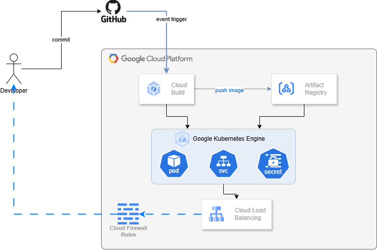

# Welcome App

This repository contains the **Welcome App**, a simple Node.js application using Express, containerized with Docker, and deployed to a Kubernetes cluster. Below are the instructions to run it locally, using Docker, Kubernetes, and deploying it to Google Kubernetes Engine (GKE).

---

## 📌 High-Level Architecture Diagrams
To better understand the deployment flow, refer to the following diagrams:

- **Non-GCP Deployment:**
  

- **GCP Deployment:**
  
---

## 1️⃣ Running Locally (Without Docker)

### Prerequisites:

- Install [Node.js](https://nodejs.org/)

### Steps:

1. Clone this repository:
   ```sh
   git clone https://github.com/ramperto/simple-devops-pipeline.git
   cd simple-devops-pipeline
   ```
2. Install dependencies:
   ```sh
   npm install
   ```
3. Start the server:
   ```sh
   npm start
   ```
4. Open a browser and go to:
   ```sh
   http://localhost:5000/welcome/<your-name>
   ```

---

## 2️⃣ Running with Docker & Docker Compose

### Prerequisites:

- Install [Docker](https://www.docker.com/get-started)
- Install [Docker Compose](https://docs.docker.com/compose/install/)

### Steps:

1. **Run using Docker:**

   ```sh
   docker build -t welcome-app .
   docker run -p 8000:5000 welcome-app
   ```

   Access the app at: `http://localhost:8000/welcome/<your-name>`

2. **Run using Docker Compose:**

   ```sh
   docker-compose up -d
   ```

   Access the app at: `http://localhost:8000/welcome/<your-name>`

To stop the containers:

```sh
docker-compose down
```

---

## 3️⃣ Running on a Local Kubernetes Cluster (Docker Desktop)

### Prerequisites:

- Install [Docker Desktop](https://www.docker.com/products/docker-desktop) with Kubernetes enabled.
- Install [kubectl](https://kubernetes.io/docs/tasks/tools/)

### Steps:

1. **Build and load the Docker image:**

   ```sh
   docker build -t welcome-app:latest .
   kind load docker-image welcome-app:latest
   ```

2. **Apply Kubernetes manifests:**

   ```sh
   kubectl apply -f deployment.yaml
   kubectl apply -f service.yaml
   kubectl apply -f ingress.yaml
   ```

3. **Get the service URL:**

   ```sh
   kubectl get svc welcome-app-service
   ```

   Access the app via the external IP.

To delete the deployment:

```sh
kubectl delete -f deployment.yaml -f service.yaml -f ingress.yaml
```

---

## 4️⃣ CI/CD Pipeline with GitHub Actions

The CI/CD workflow is defined in **`.github/workflows/build-and-push.yml`**.

### **Triggers:**

- On a new **release** event (`release: published`)
- Manually triggered (`workflow_dispatch`)

### **CI/CD Workflow:**

1. **Build & Push to Docker Hub:**

   - Builds the Docker image
   - Tags it with `latest` and version (`vX.Y.Z`)
   - Pushes it to Docker Hub

2. **Deploy to Server via SSH:**

   - Logs into a remote server
   - Pulls the latest Docker image
   - Restarts the container

#### **Triggering the workflow manually:**

1. Navigate to **GitHub Actions** tab.
2. Select `Build and deploy` workflow.
3. Click `Run workflow` and enter the tag version.

---

## 5️⃣ Deploying to Google Kubernetes Engine (GKE)

### **Prerequisites:**

- Install [gcloud CLI](https://cloud.google.com/sdk/docs/install)
- Enable **Google Kubernetes Engine API**
- Install **kubectl**

### **Steps:**

1. **Authenticate & Set Project:**

   ```sh
   gcloud auth login
   gcloud config set project [PROJECT_ID]
   ```

2. **Create GKE Cluster:**

   ```sh
   gcloud container clusters create welcome-cluster --num-nodes=2
   ```

3. **Push Image to Google Artifact Registry:**

   ```sh
   gcloud auth configure-docker
   docker tag welcome-app gcr.io/[PROJECT_ID]/welcome-app:latest
   docker push gcr.io/[PROJECT_ID]/welcome-app:latest
   ```

4. **Deploy to GKE:**

   ```sh
   kubectl apply -f deployment.yaml
   kubectl apply -f service.yaml
   kubectl apply -f ingress.yaml
   ```

5. **Get External IP:**

   ```sh
   kubectl get ingress
   ```

   Access the app using the provided IP.

---

## 📌 Contributors

Feel free to contribute to this repository by submitting pull requests!

